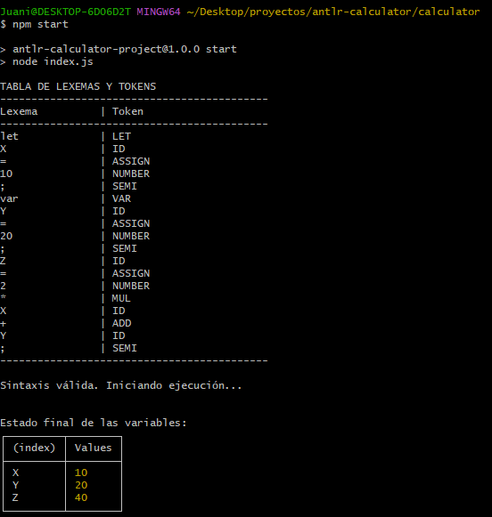
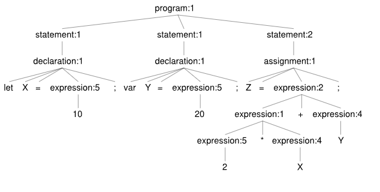

# Analizador JavaScript Reducido

Este proyecto implementa un intérprete capaz de procesar declaraciones, asignaciones y expresiones aritméticas siguiendo una gramática basada en EBNF. Utiliza ANTLR4 para la generación de los analizadores y Node.js para la lógica de ejecución.

## Instalación

### 1. Clonar el repositorio
Para obtener una copia local del proyecto, ejecutá:
```
git clone https://github.com/mbrachetta/50268.git
```

### 2. Navegar al directorio
Accedé a la carpeta donde se encuentran los archivos fuente:
cd antlr-calculator/calculator

### 3. Instalar las dependencias
Descargá los paquetes necesarios para que el proyecto funcione:
```
npm install
```

## Instrucciones de Uso

### 1. Preparar la entrada
El analizador lee el código fuente desde el archivo input.js. Aseguráte de que este archivo exista en la raíz del proyecto con el contenido que deseás testear. Ejemplo:

let X = 10;
var Y = 20;
Z = 2 * X + Y;

### 2. Ejecutar el proyecto
Para iniciar el proceso de análisis léxico, sintáctico y la ejecución semántica, ejecutá:
```
npm start
```

## Resultados del Análisis

El programa genera automáticamente los siguientes resultados:

1. Tabla de Lexemas y Tokens: Una visualización en consola de cada unidad mínima detectada por el Lexer.
2. Validación Sintáctica: Confirmación de que el código respecta la gramática definida.
3. Estado de Memoria: Una tabla con los valores finales asignados a cada variable tras la ejecución del Visitor.



### Árbol de Derivación (Punto C)
El siguiente gráfico representa la estructura jerárquica generada para el código de prueba:



## Estructura de Archivos Principal

* Calculator.g4: Gramática combinada (Lexer + Parser).
* index.js: Punto de entrada y visualización de tokens.
* CustomCalculatorVisitor.js: Lógica de ejecución y manejo de memoria.
* input.js: Archivo de entrada para el código fuente.